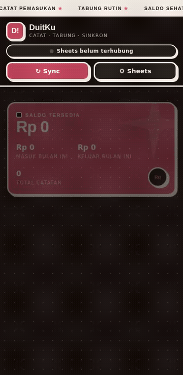

# DuitKu

A simple daily money tracker I made because I got tired of jumping between finance apps that are full of ads, lock basic features like "export data" behind subscriptions, or store my data on some random server somewhere.

DuitKu takes the opposite approach: your data stays on your own device using "localStorage". And when you want a backup, you're in full control — you can connect it to your own Google Sheet, not someone else's.

It's basically one HTML file (plus separate CSS/JS if you prefer keeping things organized like this repo). No build step, no "npm install", no framework. Open it in a browser and you're good to go.



## Why It's Built This Way

It started as a simple side project — I just wanted a lightweight place to track money coming in, going out, and savings without a bunch of setup or unnecessary complexity.

The sync is intentionally one-way (app → Sheet, not the other way around). The reason is pretty simple: fewer moving parts means fewer things that can go wrong, and there's less chance of your data getting messed up because of sync conflicts.

So DuitKu isn't really a "cloud-first" app that insists on being online all the time.

Think of it more like a notebook that happens to be able to copy its contents to Google Sheets whenever you want.

$$Features

- Track income, expenses, and savings — each as its own category instead of just "in/out"
- Balance summary + a 6-month cash flow chart
- Filter transaction history by category and search through it
- Sync to Google Sheets using your own Google Apps Script (free, no extra server required)
- Export to CSV if you don't feel like opening Google Sheets
- Fully works offline — Google Sheets is optional, not required
- Matte dark theme with maroon accents, mixing neobrutalism with a more modern touch (thick borders + offset shadows, without going overboard)

## File Structure

```
duitku/
├── index.html                    ← markup doang
├── css/style.css                 ← semua styling
├── js/script.js                  ← semua logic
└── assets/demo.gif
```

That's it.
Your data is automatically stored in the browser.

## How to Connecting to Google Sheets??
This is probably the part where people are most likely to get stuck, so here's the detailed version:

1. Open "sheets.new" (https://sheets.new) and create a new Google Sheet.
2. Inside that Sheet (not directly from script.google.com), go to Extensions → Apps Script. This matters because the script needs to be created from the Sheet itself so it is automatically bound to the correct file.
3. Delete the default code, open ⚙️ Settings in DuitKu, click Copy Code, and paste it into the Apps Script editor.
4. Go to Deploy → New deployment → choose Web app → set Execute as to Me and Who has access to Anyone.
5. Copy the URL ending in "/exec", paste it into the Web App URL field in DuitKu's Settings, then save it.
6. Test the connection using the Test Connection button before sending any actual data.

Not sure if the connection is working?
Paste the "/exec" URL directly into your browser's address bar.
If you get something like:
{"ok":true,...}
you're good.
If you get an error, it's usually related to step 2 (the script isn't properly bound to the Sheet) or step 4 (access isn't set to Anyone).
Things You Should Know (So You Don't Get Surprised)

## Stack
Vanilla JS, vanilla CSS, and a single HTML file.
Google Apps Script handles the sync backend (it's not really a backend — more like a bridge between the app and Google Sheets).
No dependencies, no "package.json", and nothing to "npm install".

## License
Use it, modify it, mess around with it — whatever.
If you find it useful or end up building something cool with it, I'd be happy to hear about it.

# EvilVoid Team -- @rixs4K -- 003
[](.)
[](.)
[](.)

